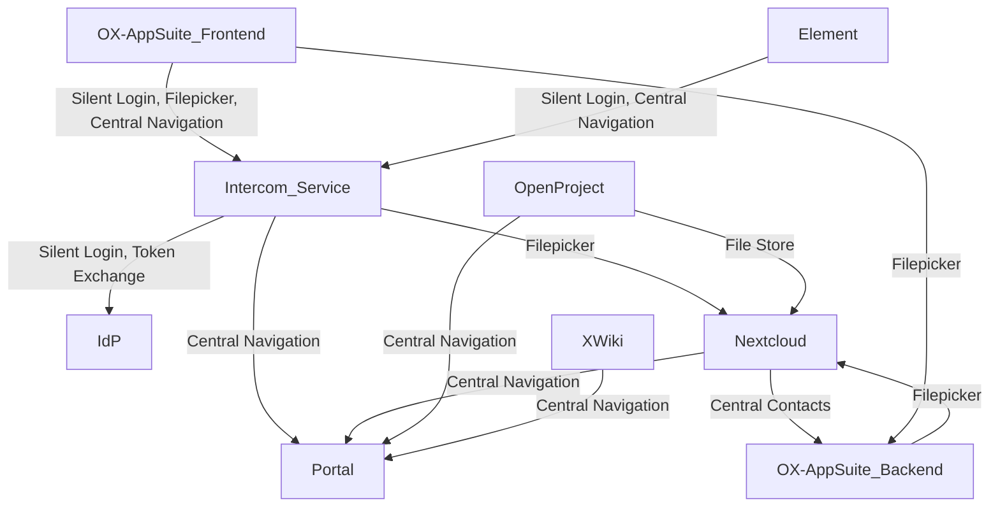
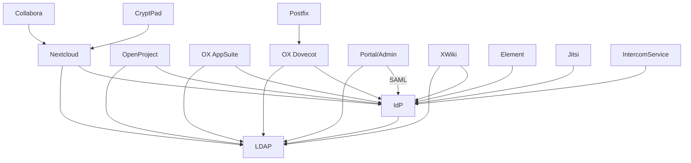

<!--
SPDX-FileCopyrightText: 2023 Bundesministerium des Innern und für Heimat, PG ZenDiS "Projektgruppe für Aufbau ZenDiS"
SPDX-FileCopyrightText: 2024 Zentrum für Digitale Souveränität der Öffentlichen Verwaltung (ZenDiS) GmbH
SPDX-License-Identifier: Apache-2.0
-->
<h1>Components</h1>

This section covers the internal system requirements and external service requirements for productive use.

<!-- TOC -->
* [Overview](#overview)
* [Component integration](#component-integration)
  * [Intercom Service / Silent Login](#intercom-service--silent-login)
  * [Filepicker](#filepicker)
  * [Central Navigation](#central-navigation)
  * [Central Contacts](#central-contacts)
  * [File Store (OpenProject -\> Nextcloud)](#file-store-openproject---nextcloud)
* [Identity data flows](#identity-data-flows)
* [Provisioning](#provisioning)
<!-- TOC -->

# Overview

openDesk consists of a variety of open-source projects. Here is a list with the description and type.

Components of type `Eval` are used for development and evaluation purposes only,
they need to be replaced in production deployments.

| Component                   | Description                    | Type       |
|-----------------------------|--------------------------------|------------|
| Certificates                | TLS certificates               | Eval       |
| ClamAV (Distributed)        | Antivirus engine               | Eval       |
| ClamAV (Simple)             | Antivirus engine               | Eval       |
| Collabora                   | Weboffice                      | Functional |
| CryptPad                    | Weboffice                      | Functional |
| dkimpy-milter               | DKIM milter for Postfix        | Eval       |
| Element                     | Secure communications platform | Functional |
| Jitsi                       | Videoconferencing              | Functional |
| MariaDB                     | Database                       | Eval       |
| Memcached                   | Cache Database                 | Eval       |
| MinIO                       | Object Storage                 | Eval       |
| Nextcloud                   | File share                     | Functional |
| Nubus (UMS)                 | Identity Management & Portal   | Functional |
| OpenProject                 | Project management             | Functional |
| OX Appsuite                 | Groupware                      | Functional |
| OX Dovecot                  | Mail backend (IMAP)            | Functional |
| Postfix                     | MTA                            | Eval       |
| PostgreSQL                  | Database                       | Eval       |
| Redis                       | Cache Database                 | Eval       |
| XWiki                       | Knowledge Management           | Functional |

# Component integration

Some use cases require inter-component integration.



Most details can be found in the upstream documentation that is linked in the respective sections.

## Intercom Service / Silent Login

The Intercom Service is deployed in the context of Nubus/UMS. Its role is to enable cross-application integration
based on the user's browser interaction as handling authentication when the frontend of an application has to call
the API from another application is often a challenge.

To establish a session with the Intercom Service, applications can use the silent login feature within an iframe.

Currently, only OX AppSuite and Element are using the frontend-based integration.

**Links**
- [Intercom Service upstream documentation](https://docs.software-univention.de/intercom-service/latest/index.html).

## Filepicker

The Nextcloud Filepicker is integrated into the OX AppSuite, supporting the following use cases against the respective openDesk instance's Nextcloud:
- Attach files from Nextcloud to emails.
- Create and add links to Nextcloud files into emails.
- Save attachments from emails into Nextcloud.
- Attach files from Nextcloud to calendar entries.

The Filepicker uses frontend and backend-based integration:
- For frontend-based integration, the OX AppSuite frontend uses the Intercom Service.
- Backend-based integration is coming from OX AppSuite middleware. The middleware communicates directly with Nextcloud
when adding a file to an email or storing a file into Nextcloud to avoid passing these files through the user's browser.

**Links**
- [OX AppSuite Nextcloud Integration upstream documentation](https://gitlab.open-xchange.com/extensions/nextcloud-integration/-/tree/main/documentation).

## Central Navigation

Central navigation is based on an API endpoint in the Nubus portal that returns a JSON containing the portal's contents for
a given user. The response from the API endpoint is used in the openDesk applications to render the central navigation.

The API can be called by
- frontend services through the Intercom Service's `/navigation.json` endpoint or
- backend services directly at the portal's `/univention/portal/navigation.json` endpoint.

The central navigation expects the API caller to present a shared secret for authentication and the username for whom the portal
contents should be returned for.

A `curl` based request returning the navigation contents looks like this:

```
curl 'https://portal.<DOMAIN>/univention/portal/navigation.json?base=https%3A//portal.<DOMAIN>&language=de-DE' -u "<USERNAME>:<SHARED_SECRET>"
```

## Central Contacts

OX App Suite is managing contacts in openDesk. Therefore, Nextcloud's PHP backend is using the OX AppSuite's middleware Contacts API to
- create a new contact in the user's contacts folder when a file is shared with an unknown email address.
- retrieve contacts from the user's contacts folder to support search-as-you-type when starting to share a file.

**Links:**
- Currently used [OX Contacts API (deprecated)](https://documentation.open-xchange.com/components/middleware/http/8/index.html#!Contacts).
- New [OX Addressbooks API](https://documentation.open-xchange.com/components/middleware/http/8/index.html#!Addressbooks) the Central Contacts integration will switch to.

## File Store (OpenProject -> Nextcloud)

While OpenProject allows you to attach files to work packages directly, it is often preferred that the files are
stored within Nextcloud or to link an existing file from your openDesk Nextcloud to a work package.

Therefore, openDesk pre-configures the trust between the openDesk instance's OpenProject and Nextcloud during the `openproject-boostrap` deployment step. As a prerequisite for that, openDesk's Nextcloud contains the `integration_openproject` app.

The file store must still be enabled per project in OpenProject's project admin section.

**Links:**
- [OpenProject's documentation on Nextcloud integration](https://www.openproject.org/docs/system-admin-guide/integrations/nextcloud/)
- [OpenProject Integration Nextcloud app](https://apps.nextcloud.com/apps/integration_openproject)

# Identity data flows

An overview of
- components that consume the LDAP service.
  - The components access the LDAP using a component-specific LDAP search account.
- components using Univention Keycloak as an identity provider (IdP).
  - The components should use OAuth2 / OIDC flows if not otherwise denoted.
  - All components have a client configured in Keycloak, except for Jitsi, which is using authentication with the
 [Authorization Code Flow](https://openid.net/specs/openid-connect-core-1_0.html#CodeFlowAuth) that does not
 require an OIDC client to be configured in Keycloak.

Some components trust others to handle authentication for them.



# Provisioning

Currently, active provisioning is only done for OX AppSuite. The OX-Connector synchronizes the following objects to the OX AppSuite using the AppSuite's SOAP API:

- Contexts
- Users
- Groups
- Functional Mailboxes
- Resources
